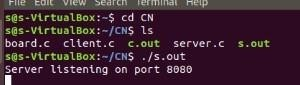
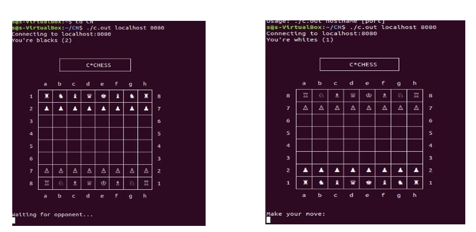
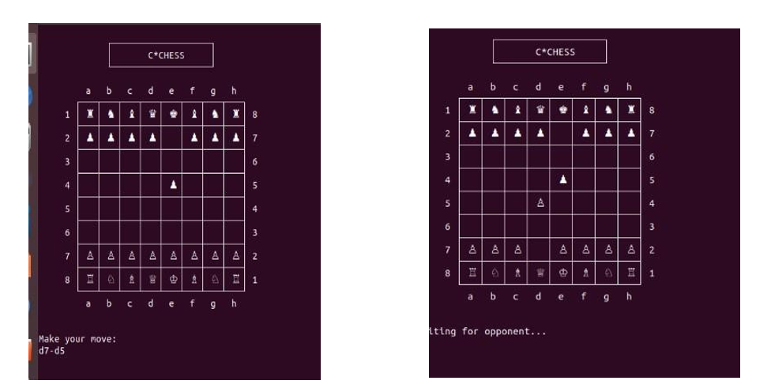

# Chess-Socket-Programming

## Table of Contents  
- [Overview](#overview)  
- [Features](#features)  
- [Project Structure](#project-structure)  
- [Installation & Setup](#installation--setup)  
  - [Clone the Repository](#1-clone-the-repository)  
  - [Compile the Server & Client](#2-compile-the-server--client)  
    - [For Server](#for-server)  
    - [For Client](#for-client)  
- [How to Play](#how-to-play)  
  - [Start the Server](#1-start-the-server)  
  - [Start the Clients](#2-start-the-clients)  
  - [Gameplay](#3-gameplay)  
- [Screenshots](#screenshots)  
- [Troubleshooting](#troubleshooting)  
- [References](#references)  
- [Contributors](#contributors)  

---

## Overview
This project is a multiplayer Chess Game implemented using **C** and **socket programming**. It allows two players to connect over a network and play chess in real-time, using a **client-server architecture**.

## Features
-  **Multiplayer Support** – Two players can connect remotely.
-  **Socket Programming** – Uses TCP sockets for real-time communication.
-  **Client-Server Architecture** – One player acts as the host (server), and another joins as a client.
-  **Command-Line Interface (CLI)** – Play chess using terminal commands.
-  **Efficient Communication** – Optimized data exchange between players.

---

## Project Structure
```
Chess-Socket-Programming/
│── client/                      # Client-side code
│   │── client.c                 # Client implementation
│   │── board.c                  # Board logic for the client
│   │── Makefile                 # Compilation instructions for the client
│── server/                      # Server-side code
│   │── server.c                 # Server implementation
│   │── board.c                  # Board logic for the server
│   │── Makefile                 # Compilation instructions for the server
│── docs/                        # Documentation
│   │── Ouptut.pdf               # Project report
│── assets/                      # Server-side code
│   │── server.png                
│   │── client1.png                 
│   │── client2.png                  
│── scripts/                     # Helper scripts
│   │── setup.sh                 # Automates compilation
│── .gitignore                   # Ignore unnecessary files
│── README.md                    # Project documentation (this file)
```

---

## Installation & Setup

### **1. Clone the Repository**
```sh
git clone https://github.com/anna123venkat/Chess-Socket-Programming.git
cd Chess-Socket-Programming
```

### **2. Compile the Server & Client**
Run the setup script to compile both:
```sh
chmod +x setup.sh
./setup.sh
```

Or manually compile:

#### **For Server**
```sh
cd server
make
```

#### **For Client**
```sh
cd client
make
```

---

## How to Play

### **1. Start the Server**
Navigate to the `server` directory and run:
```sh
./server
```
The server will start listening for incoming connections.

### **2. Start the Clients**
Each player must launch the client and connect to the server:

```sh
./client <server_ip> <port>
```
Example:
```sh
./client 127.0.0.1 8080
```
- Replace `<server_ip>` with the actual server address.
- The default port is **8080**.

### **3. Gameplay**
- Players will receive turn-based prompts.
- Enter moves in standard chess notation (e.g., `e2-e4`).
- The opponent's move will be displayed on your board.

---

## Screenshots
### Server Running:


### Clients Playing:



---

## Troubleshooting
- If compilation fails, ensure you have **GCC** and **Make** installed.
- If the client cannot connect:
  - Check if the server is running.
  - Verify the IP address and port.
  - Ensure no firewall is blocking connections.

---

## References
- [Socket Programming in C](https://www.geeksforgeeks.org/socket-programming-cc/)
- [Multiplayer Chess with Sockets](https://github.com/eneskzlcn/Chess)

---

## Contributors

- **[Prasanna Venkatesh S](https://github.com/anna123venkat)**
- **[Naboth Demitrius](https://github.com/demi2k-sudo)**
- **[Dinesh Kumar](https://github.com/sudoDinesh)**

---
